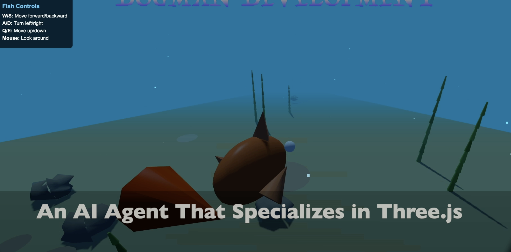
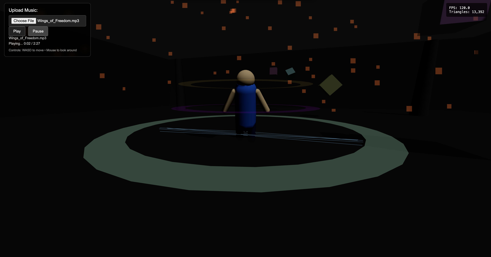

# threewzrd

AI-powered CLI for generating Three.js projects from natural language.

Describe what you want to build and let the AI create complete, runnable Three.js scenes for you.

## Installation

```bash
npm install -g threewzrd
```

Requires Node.js 18 or higher.
The default model is claude sonnet we recommend using opus for complex coding
users can change the model by using command threewzrd model [your model] EX. threewzrd model opus4.5

## Quick Start

1. Get an API key from [Anthropic Console](https://console.anthropic.com/)

2. Start the wizard:
   ```bash
   threewzrd start
   ```

3. Enter your API key when prompted (it can be saved locally and securely for future sessions if requested)

4. Describe what you want to build:
   ```
   > Create a rotating cube with a gradient shader
   ```

The wizard will generate all necessary files (HTML, JavaScript, shaders) and guide you through running them.

## Commands

### `threewzrd start [directory]`

Start an interactive session in the specified directory (defaults to current directory).

```bash
threewzrd start
threewzrd start ./my-project
```

### `threewzrd config`

View current configuration.

```bash
threewzrd config
```

### `threewzrd config --set`

Set or update your API key.

```bash
threewzrd config --set
```

### `threewzrd config --delete`

Delete your saved API key.

```bash
threewzrd config --delete
```

### `threewzrd config --path`

Show the config file location.

```bash
threewzrd config --path
```

## API Key Setup

Your API key is stored securely at `~/.threewzrd/.env` with restricted permissions (owner read/write only).

You can also set it via environment variable:

```bash
export ANTHROPIC_API_KEY=sk-ant-...
threewzrd start
```

Or create a `.env` file in your project directory:

```
ANTHROPIC_API_KEY=sk-ant-...
```

## Features

- **Natural Language Input**: Describe 3D scenes in plain English
- **Complete Project Generation**: Creates HTML, JavaScript, and shader files
- **Interactive REPL**: Iterate on your designs with follow-up requests
- **File Management**: Automatically organizes generated files
- **Secure**: API keys are masked during input and stored with restricted permissions
- **Command Safety**: Only whitelisted commands can be executed

## Examples

```
> Create a particle system that looks like falling snow

> Make a 3D solar system with orbiting planets

> Build a terrain with procedural noise and water

> Create a first-person camera controller
```

## Security

- API keys are stored with `0600` permissions (owner read/write only)
- Input is masked when entering API keys
- Commands are restricted to a safe whitelist (npm, npx, node, git, etc.)
- File operations are sandboxed to the working directory
- Use this agent at your own risk as it does edit and read files.


## License

MIT

## ScreenShots
    